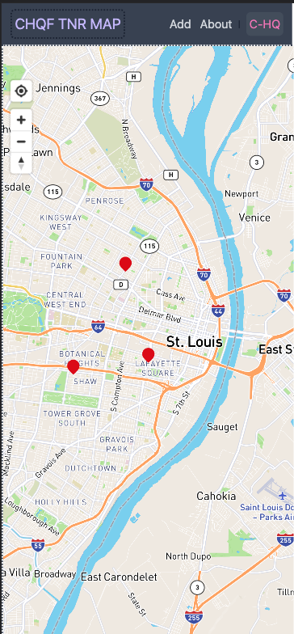
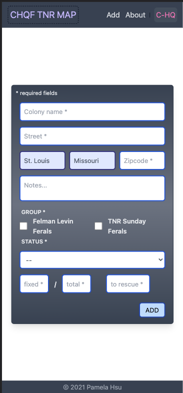
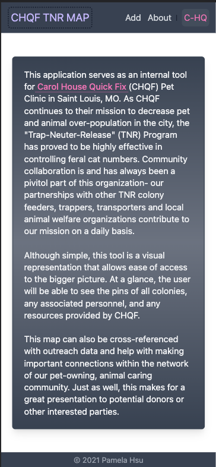

# CHQF TNR MAP  

## Table of Contents
1. [Project Overview](#Project-Overview)
2. [Deployement](#Deployement)
3. [Application Screenshots](#Application-Screenshots)
4. [Project-build Aspects](#Project-build-Aspects)
5. [Installation](#Installation)
6. [Usage](#Usage)
7. [License](#License)
8. [Credit](#Credit)
****

## Project overview

Carol House Quick Fix Pet Clinic (Saint Louis, MO) TNR (trap-neuter-release) map of colonies and related resources for internal usage and visual aid. Focused on a mobile-first design for ease of use while out around the city.

### Project Status:

*ONGOING*

#### Issues to debug:
- native mapbox vs react-map-gl
- saving formatted geoJSON data to variable to use for addLayer
- lacking any code testing

****

## Deployment
*TBD*

## Application Screenshots
**Mapbox with pins**:
- this uses the Pin component of the react-map-gl framework *DATA QUANTITY EXCEEDS PERFORMANCE LEVEL OF PIN COMPONENT: THIS SCREENSHOT IS FOR VISUAL PURPOSES ONLY*

**Add form:**
- this is currently a navbar link to a seperate page with plans to use the same form as a pop-up when a new pin is dropped onto the map with the goal to improve efficiency and function

**About page:**
- a simple about page with link to CHQF's website - the pink navbar link "C-HQ" is for the cloud based clinic management software CHQF uses to track individual animals and services

****

## Project-build Aspects:

The following components are used to build the code for this project:

1. Next.js
2. Tailwind CSS
3. Mapbox
    - react-map-gl [?]
    - Mapbox Geocoding API
4. MongoDB Atlas

### Functionality:

The following lists all functions within this project:

* user will be able to interact with map pins of colony locations to pull up general information
* user will be able to add new colony data
* user will be able to edit and delete colony data as necessary

On deck
* user will be able to search by client or colony information [?]

### Process:

****

## Installation

1. Clone this repository onto local workspace
2. Open Terminal (MacOS) or Git Bash (Windows) and change location to where you want the cloned directory
3. Type `git clone` and paste copied respository
4. Directory should include the following:

## Usage
*TBD*

****

## License

This application is licensed under MIT, please see the corresponding file in the repo directory.

## Credit
*TBD*